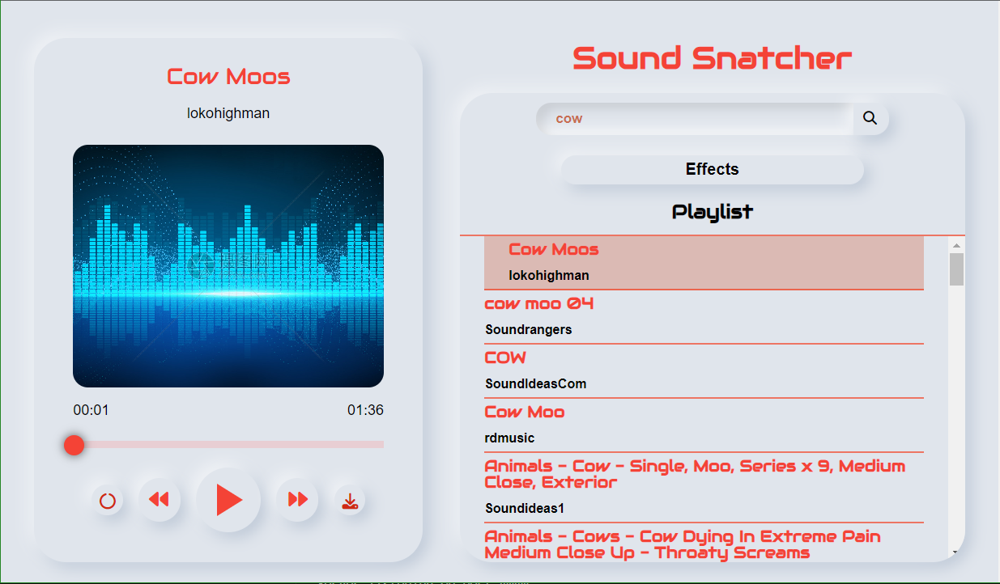

# Sound Snatcher

No Frills. Just Sounds.



## Description

Sound Snatcher uses pond5.com api to search and curate sound effects and displays them in an easy to use interface.

## Getting Started


### Installing

* Use the following command in the preferred folder to install this repository.
```
git clone https://github.com/Archetypical/Sound-Snatcher.git
```

### Dependencies

* Run the following command to install then necessary dependencies
```
npm install
```

### Executing program

* Use the start command
```
npm start
```
* Then navigate to localhost:4040 in the browser of your choice.

## Authors

Contributors names and contact info

Coleman Toups

## Version History

* 1.0
    * Initial Release

## License

This project is licensed under the MIT License - see the LICENSE.md file for details

## Acknowledgments

Inspiration, code snippets, etc.
* [awesome-readme](https://github.com/matiassingers/awesome-readme)
